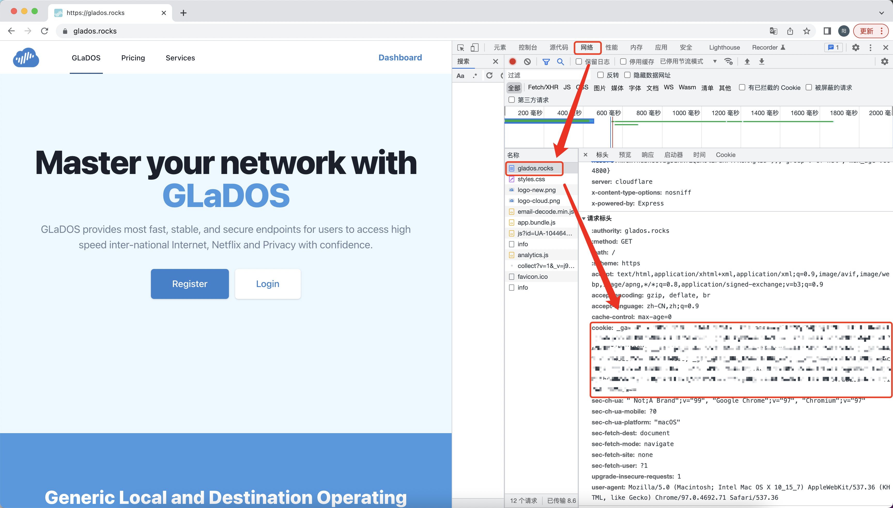
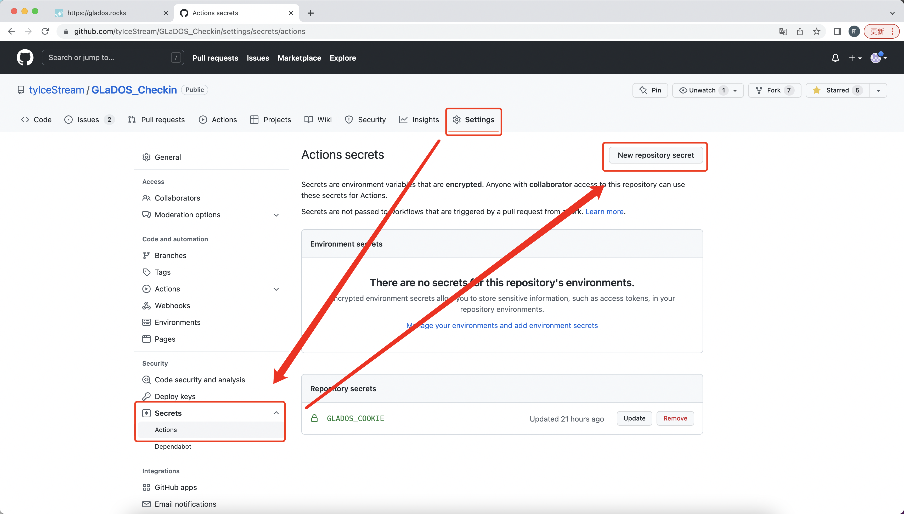
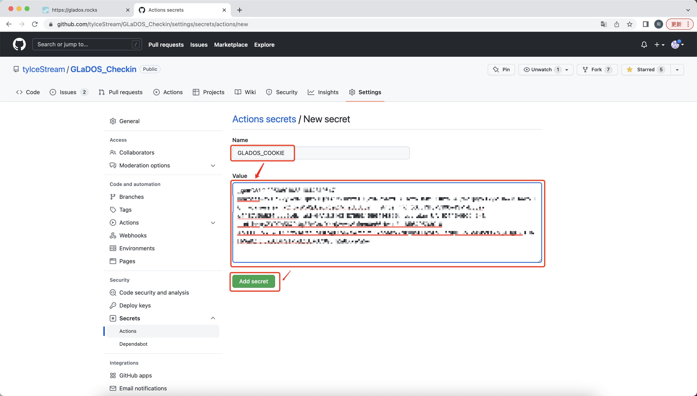
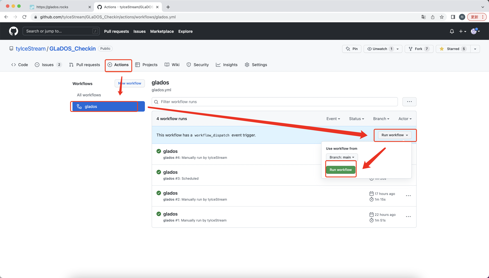
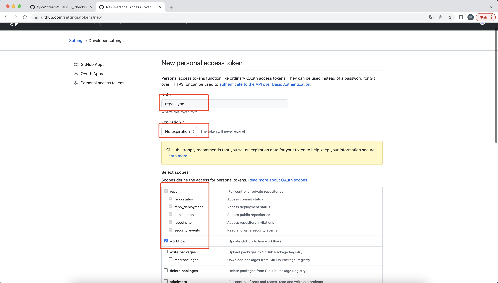
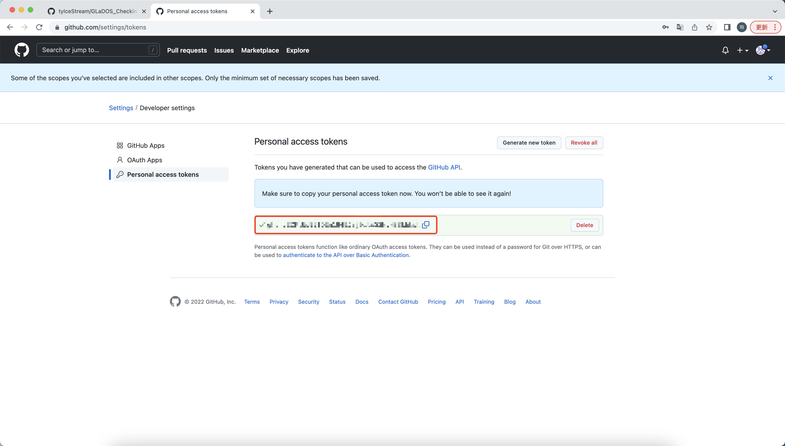

# GLaDOS_Checkin
GLaDOS automatic check-in bypassing CloudFlare using github action

## 功能描述
1. 每日自动进行签到（本项目可通过CloudFlare反爬机制）
2. 支持多用户签到，多个Cookie之间采用`&&`手动分割
3. 【可选】支持将签到消息推送至Server酱，Pushplus，企业微信，Bark
4. 【可选】支持自动同步上游仓库代码，自动获取最新版本。
5. 本项目可触发Github Notifications，出现Cookie过期/签到失败等可自动发送Email
6. 本项目包含Github Actions keep alive模块，可自动激活Github Actions

## 使用方法

### 1. 添加 Cookie 至 Secrets
- 登陆[GLaDOS](https://glados.rocks/)后，F12打开开发者工具。
- 刷新网页，并在浏览器中提取复制`Cookie`项（本程序可处理`Cookie:`前缀，使用者复制该项时是否具有前缀均可)

  

- 在项目页面，依次点击`Settings`-->`Secrets`-->`Actions`-->`New repository secret`

  

- 建立名为`GLADOS_COOKIE`的 secret，值为复制的`Cookie`内容，最后点击`Add secret`
- secret名字必须为`GLADOS_COOKIE`，大小写敏感
- 支持多用户签到，多个Cookie之间采用`&&`手动分割完成后填入`GLADOS_COOKIE`即可
- 为保护隐私，不在日志中输出任何Id信息，请自行分辨账号顺序

  

### 2. 启用 Actions
- 在项目页面，依次点击`Actions`-->`glados`-->`Run workflow`-->`Run workflow`以激活Actions

  

- Workflow开启后，每日0时30分自动执行。

## 3. 消息推送 （可选）
本项目支持将签到消息推送至第三方平台，用户选择其希望推送的平台并配置相关token即可。若用户不需要将消息推送至某个（些）平台，则无需对作作出任何配置。

### 3.1 Pushplus
将消息推送至[Pushplus](https://www.pushplus.plus)需手动配置`token`，并在本仓库创建名为`PUSHPLUS_TOKEN`的secret，将`token`作为`PUSHPLUS_TOKEN`的值。

### 3.2 Server酱
将消息推送至[Server酱](https://sct.ftqq.com/sendkey)需手动配置`SendKey`，并在本仓库创建名为`SERVERCHAN_SENDKEY`的secret，将`SendKey`作为`SERVERCHAN_SENDKEY`的值。

### 3.3 企业微信
将消息推送至[企业微信](https://sct.ftqq.com/sendkey)需手动配置群聊机器人`Webhook地址`，并在本仓库创建名为`WECOM_WEBHOOK`的secret，将`Webhook地址`作为`WECOM_WEBHOOK`的值。

- 此处请输入<b>完整</b>的Webhook地址，包含`https://qyapi.weixin.qq.com/cgi-bin/webhook/send?`前缀，无需手动去除，切勿仅输入`key`值。
- 受制于第三方开发者ip访问限制，本项目暂不支持在Github Actions环境中将消息推送至企业微信应用。

### 3.4 Bark
将消息推送至[Bark](https://github.com/Finb/Bark)需手动配置`DeviceKey`，并在本仓库创建名为`BARK_DEVICEKEY`的secret，将`DeviceKey`作为`BARK_DEVICEKEY`的值。

## 4. 自动同步 （可选）

本项目提供了一种用于自动和上游仓库进行同步的工作流。该工作流开启后，将会<b>自动从上游仓库拉取代码并覆盖掉自行修改的内容</b>。该工作流有助于从源仓库获取最近更新，但不利于对本项目进行的二次开发。

工作流默认不触发，开启后每周一执行一次，若需关闭/开启可参考[禁用和启用工作流程](https://docs.github.com/cn/enterprise-server@3.3/actions/managing-workflow-runs/disabling-and-enabling-a-workflow)。

配置步骤如下：
1. 首先[生成Personal access token](https://github.com/settings/tokens/new)用于获得对仓库的访问权限。

  

- `Note`项填写token的名字，用户自由命名即可
- `Expiration`项填写token过期时长，建议填写为`No Expiration`
- `Select scopes`项依据图示选择`repo`项全部内容和`workflow`项

2. 滑动到页面最下方点击`Generate token`获得token，并手动复制token值。<b>该token值仅显示一次，关闭页面后无法找回。</b>

  

3. 在本仓库创建名为`PAT`的secret，将上一步生成的token作为`PAT`的值。

4. 手动启动触发工作流以开启自动同步功能。

## 鸣谢
- 感谢[yaoysyao](https://github.com/yaoysyao)支持将消息推送至Pushplus的相关内容
- 感谢[AstbReal](https://github.com/AstbReal)支持将消息推送至Server酱和企业微信的相关内容及GLaDOS用户status的解析策略
